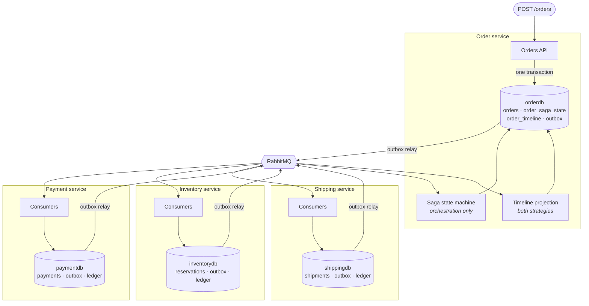

# Order Saga System

Four services, one order, two coordination strategies, and every failure path driven on purpose.

[](https://github.com/tunahanaliozturk/order-saga-system/actions/workflows/ci.yml)
[](LICENSE)
[](global.json)

Placing an order touches Order, Payment, Inventory and Shipping. Each owns its own database, so no
transaction spans them. Two-phase commit is not an option in a cloud-native system, and calling the next
service's API and hoping produces inconsistent state the first time a call fails after an earlier one has
already committed.

A saga replaces one distributed transaction with a sequence of local ones, each publishing a message that
triggers the next, with compensating transactions to undo what already committed when a later step fails.
This repository implements that flow twice, as an orchestrated saga and as a choreographed one, on the same
four services, so the trade-off between them is visible in code rather than asserted in an interview.

## What it guarantees

| Promise | How | Proven by |
| --- | --- | --- |
| An event is never lost between a business write and the broker | Transactional outbox: the event row commits with the business change or not at all | [`A_message_staged_by_a_process_that_died_is_still_published`](tests/OrderSaga.IntegrationTests/ResilienceTests.cs) |
| The same message delivered ten times produces one charge | A unique constraint on a ledger of applied messages, written in the same transaction as the effect | [`Ten_copies_of_one_message_produce_one_charge`](tests/OrderSaga.IntegrationTests/ResilienceTests.cs) |
| Whatever committed gets undone, in reverse, from wherever the chain broke | Compensating commands with their own idempotency, driven from the step that failed | [`SagaFlowTests`](tests/OrderSaga.IntegrationTests/SagaFlowTests.cs) |
| The orchestrator can be killed mid-saga and carry on | Saga state in typed columns in Postgres, never in process memory | [`The_orchestrator_resumes_from_persisted_state_after_a_restart`](tests/OrderSaga.IntegrationTests/ResilienceTests.cs) |
| Both coordination strategies behave the same | The same scenarios run against both routes, timelines compared | [`ContractEquivalenceTests`](tests/OrderSaga.IntegrationTests/ContractEquivalenceTests.cs) |
| An order that stops making progress becomes alertable | A sweep flags anything non-terminal past its timeout | [`An_order_that_stops_making_progress_is_flagged_rather_than_forgotten`](tests/OrderSaga.IntegrationTests/ResilienceTests.cs) |

Twenty integration tests against real Postgres and real RabbitMQ, plus eight state-machine tests on an
in-memory bus. Every failure path in the table is produced deliberately, not waited for.

## Quick start

```bash
docker compose up --build
```

Postgres with four databases, RabbitMQ with its management UI, and all four services. Then:

```bash
SKU=$(uuidgen)

# An orchestrated order. A central state machine tells each service what to do next.
ORDER=$(curl -s localhost:5000/orders \
  -H 'Content-Type: application/json' \
  -d "{\"customerId\":\"$(uuidgen)\",\"lines\":[{\"sku\":\"$SKU\",\"quantity\":2,\"unitPrice\":19.99}]}" \
  | jq -r .id)

curl -s localhost:5000/orders/$ORDER | jq '{status, sagaVariant}'
curl -s localhost:5000/orders/$ORDER/timeline | jq -r '.[] | "\(.serviceName)\t\(.eventType)"'
```

```
order    OrderCreated
payment  PaymentAuthorized
inventory InventoryReserved
shipping ShipmentScheduled
```

The same order through the choreographed route is `POST /orders/choreographed`. Nothing else changes, and
the timeline comes out the same, which is the entire point.

### Watching a compensation

```bash
# Every shipment now fails. Two steps will already have committed by the time it does.
curl -s -X POST localhost:5003/test/shipping/fault-rate \
  -H 'Content-Type: application/json' -d '{"rate":1.0,"mode":0}'

ORDER=$(curl -s localhost:5000/orders \
  -H 'Content-Type: application/json' \
  -d "{\"customerId\":\"$(uuidgen)\",\"lines\":[{\"sku\":\"$(uuidgen)\",\"quantity\":1,\"unitPrice\":49.00}]}" \
  | jq -r .id)

sleep 3
curl -s localhost:5000/orders/$ORDER/timeline | jq -r '.[] | "\(.serviceName)\t\(.eventType)"'
```

```
order     OrderCreated
payment   PaymentAuthorized
inventory InventoryReserved
shipping  ShipmentFailed
inventory InventoryReleased
payment   PaymentRefunded
```

Two steps committed, both came back. The stock is on the shelf again and the hold on the card is gone, and
you can check both directly at `localhost:5002/inventory/stock/$SKU` and
`localhost:5001/payments/$ORDER`.

### Running it with Aspire instead

```bash
dotnet run --project src/OrderSaga.AppHost
```

Same stack, plus the dashboard. One trace spans all four services for a single order, which is the fastest
way to see what either strategy actually does.

## How it works



Every service owns a database, an outbox, and an idempotency ledger. Nothing reads another service's
schema, and nothing calls another service's API: every interaction is a message.

### The outbox

A business write and a message publish are not atomic. A crash between them leaves the system permanently
inconsistent: the payment is authorized and nobody will ever be told to ship. So the event is a row in
`outbox_messages`, written in the same transaction as the change that caused it, and a relay publishes it
afterwards, at least once, until the broker acknowledges.

```csharp
_dbContext.Payments.Add(payment);
_outbox.Stage(new PaymentAuthorized(orderId, variant, payment.Id, amount));
// The guard commits both, together with the ledger entry.
```

The relay claims rows with `FOR UPDATE SKIP LOCKED`, so several instances of a service can run it without
publishing anything twice, and it marks a row published only after the broker confirms. A crash in between
republishes rather than loses, which is the right way round when every consumer is idempotent.

It is hand-written rather than configured, for reasons in [ADR 2](docs/adr/0002-hand-rolled-outbox.md).
That decision paid for itself: building it surfaced a bug where the relay started before the bus and
published into exchanges whose queues did not exist yet. RabbitMQ discards those messages without raising
anything anywhere.

### Idempotency

The broker delivers at least once, so every consumer sees the same message twice eventually. For a consumer
that charges a card, that is a second charge.

```sql
CREATE TABLE processed_messages (
    consumer_name text NOT NULL,
    message_id    uuid NOT NULL,
    processed_at  timestamptz NOT NULL,
    PRIMARY KEY (consumer_name, message_id)
);
```

Consumers insert into it as part of the same `SaveChangesAsync` as their business change, and treat a
unique-constraint violation as "already done". Not a check followed by a write: two concurrent redeliveries
both pass a check and both proceed, and that is exactly the race that produces the double charge. See
[ADR 3](docs/adr/0003-idempotency-in-the-database.md).

Business tables carry their own unique constraints as a second line. One payment per order, one reservation
per order, one shipment per order, enforced by the database rather than by hope.

### Compensation

| Failure point | What had committed | What is undone |
| --- | --- | --- |
| Payment declined | Nothing | Nothing. A refund here would reverse a charge that never happened |
| Stock unavailable | The payment | Refund |
| Shipment failed | The payment and the reservation | Release, then refund |
| Operator cancels a completed order | All three | Cancel the shipment, release, refund |

Compensations are first-class commands with their own idempotency, not history replayed backwards. A refund
is a real call with real effects; treating it as data replay would hide that it needs the same failure
handling as the forward path.

The order is only marked cancelled once every compensation has confirmed. Declaring it after the first
would report an unwound order while a service was still holding something.

### Orchestration against choreography

Both run at once, on the same services. The route decides which handles an order.

```csharp
// Orchestration: one place knows the whole flow.
During(AwaitingShipment,
    When(ShipmentRejected)
        .Then(context => RequestRelease(context))
        .Then(context => RequestRefund(context))
        .TransitionTo(Compensating));
```

```csharp
// Choreography: each participant hears about the failure and undoes its own work.
public sealed class RefundOnShipmentFailedConsumer : IdempotentConsumer<ShipmentFailed> { ... }
```

What the code shows, rather than what the usual summary asserts:

- **Coupling is visible.** `OrderStateMachine` names all three downstream services. No choreographed
  participant names any other.
- **Choreography pushes state into participants.** `PaymentAuthorized` does not carry order lines, and
  Inventory may not read the Order service's database, so it persists what it heard from `OrderCreated` in
  a table of its own. The orchestrator needs none of that.
- **Choreography inherits races the orchestrator does not have.** Nothing guarantees Inventory processed
  `OrderCreated` before Payment published `PaymentAuthorized`. The consumer throws and lets the transport
  redeliver, which works, but the race exists only because nobody is coordinating.
- **Some operations need a coordinator.** Unwinding a completed order is orchestrated-only; the
  choreographed route answers 409. That is the pattern's limit, not this implementation's.

A contract suite runs the same scenarios against both routes and compares the timelines, so "they behave
equivalently" fails a build when it stops being true. Full reasoning in
[ADR 4](docs/adr/0004-both-saga-styles.md).

### Ordering

Messages for one order are processed one at a time; different orders run in parallel. Without that, the
timeline recorded events in whatever order their transactions happened to commit, and two events reaching
the same saga instance collided on the concurrency token. One line fixes both:

```csharp
rabbit.UsePartitioner(16, context => context.CorrelationId ?? Guid.Empty);
```

The correlation id is the order id, threaded through every message, every log line, and every trace. See
[ADR 5](docs/adr/0005-ordering-per-correlation-id.md).

## API

| Method | Route | Purpose |
| --- | --- | --- |
| `POST` | `/orders` | Place an order, coordinated by the state machine |
| `POST` | `/orders/choreographed` | Place an order, coordinated by nobody |
| `GET` | `/orders/{id}` | Status, saga variant, cancellation reason, stuck flag |
| `GET` | `/orders/{id}/timeline` | Everything that happened, in order, with the event bodies |
| `GET` | `/orders/stuck` | Orders past their timeout without a terminal state |
| `POST` | `/orders/{id}/retry` | Re-drive the current step. Safe to repeat |
| `POST` | `/orders/{id}/cancel` | Unwind a completed order. Orchestrated only |
| `GET` | `/payments/{orderId}` | What the Payment service did |
| `GET` | `/inventory/reservations/{orderId}` | What the Inventory service did |
| `PUT` | `/inventory/stock/{sku}` | Set stock. Zero is how you make something unavailable |
| `GET` | `/shipments/{orderId}` | What the Shipping service did |
| `POST` | `/test/{service}/fault-rate` | Turn a failure on. A runtime dial, not a build flag |

Publishing an event from your own service is one call inside the transaction you already have open:

```csharp
invoice.MarkPaid(paidAt);
outbox.Stage(new OrderCreated(order.Id, variant, order.CustomerId, order.Total, lines, now));
await dbContext.SaveChangesAsync(cancellationToken);
```

No retry policy to configure, no broker to reach, and nothing to reason about if the transaction rolls
back.

## Running the tests

```bash
dotnet run --project tests/OrderSaga.UnitTests          # state machine, in-memory bus, ~2s
dotnet run --project tests/OrderSaga.IntegrationTests   # four services, real infrastructure, needs Docker
```

The integration suite starts all four services in one process against Testcontainers Postgres and RabbitMQ.
Each test gets four fresh databases and its own broker virtual host, because MassTransit publishes to
per-message-type exchanges and two tests sharing a broker deliver each other's events into each other's
queues.

Things the suite asserts that are easy to claim and easy to get wrong:

- A payment declined at the first step compensates nothing, because nothing downstream committed.
- A failed shipment puts the stock back on the shelf, checked by reading the stock count, not the status.
- Three operator nudges on the same order produce one charge.
- An order whose participant never returns is flagged, and the flag clears itself when it recovers.
- The choreographed and orchestrated routes produce the same timeline for the same scenario.

There is also a load harness that reports saga completion latency separately from API latency, because the
API call is a local database write and says nothing about how long the saga took:

```bash
dotnet run --project load/OrderSaga.LoadTests -- http://localhost:5000 150 300
```

It is written by hand and has no package references. It fires requests on a fixed schedule rather than
waiting for each response, because a closed loop measures the system at whatever rate it happens to allow,
which is the load test telling you what you already knew.

## Running it

[`docs/runbook.md`](docs/runbook.md) covers what a stuck order means, how to read a timeline, when to retry
rather than cancel, and the retention coupling between the outbox and the idempotency ledger.
[`OrderSaga.http`](OrderSaga.http) walks both flows by hand, including driving shipping to total failure and
watching both committed steps come back.

## Dependency licences

Every package in the tree, at every depth, is permissively licensed, and the build checks rather than
assumes:

```bash
dotnet run --project tools/OrderSaga.LicenseAudit -- .
```

```
Checking 160 packages against 12 allowed licences.

   116  MIT
    36  Apache-2.0
     3  BSD-3-Clause
     3  PostgreSQL
     1  BSD (file)
     1  Apache-2.0 OR MPL-2.0

All 160 packages are permissively licensed.
```

This runs in CI. It exists because two dependencies here were not permissive and neither was visible from a
package list: NBomber shipped a paid commercial subscription agreement, and JsonPatch.Net, three levels
below Aspire, shipped a maintenance-fee agreement asking revenue-generating users for a monthly payment.
Both were replaced. Reasoning in [ADR 6](docs/adr/0006-permissive-dependencies-only.md).

## What this does not do

Worth being explicit, because a project claiming no limitations is not being honest about any:

- **Eventual consistency, not exactly-once.** Delivery is at-least-once and effects are made idempotent.
  That is the honest guarantee, and it is why the ledger exists.
- **The payment, inventory and shipping behaviour is simulated.** This is a saga-correctness project. The
  resilience engineering around a genuinely flaky third-party API is a different project.
- **Single region, single broker.** No cross-region sagas, no active-active, no regional failover.
- **No saga versioning.** Changing the state machine's shape while instances are in flight is a real
  production concern and is not handled here.
- **Migrations run on startup**, which suits one instance per service. A real deployment migrates as a
  separate step so that several instances rolling at once cannot race into the same lock.
- **Authentication is out of scope.** The services trust each other and the network between them.

## Design decisions

- [1. MassTransit 8, not 9](docs/adr/0001-masstransit-8-not-9.md)
- [2. A hand-rolled outbox rather than the one in the box](docs/adr/0002-hand-rolled-outbox.md)
- [3. Idempotency is a unique constraint, not application code](docs/adr/0003-idempotency-in-the-database.md)
- [4. Both coordination strategies, on the same services](docs/adr/0004-both-saga-styles.md)
- [5. One order at a time, all orders in parallel](docs/adr/0005-ordering-per-correlation-id.md)
- [6. Permissive dependencies only, checked by the build](docs/adr/0006-permissive-dependencies-only.md)

Operational guide: [docs/runbook.md](docs/runbook.md).

## Built with

.NET 10, C# 14, ASP.NET Core minimal APIs, MassTransit 8.5 over RabbitMQ, EF Core 10 on PostgreSQL 18,
OpenTelemetry, .NET Aspire for local orchestration, xUnit v3 and Testcontainers for the tests. The load
harness and the licence audit are hand-written and depend on nothing.

## License

MIT. See [LICENSE](LICENSE).
